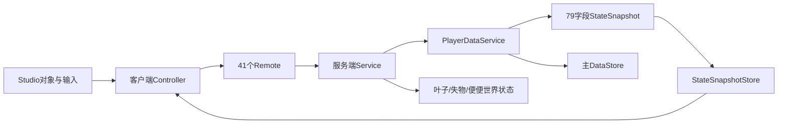

# 代码健康审计

> 审计日期：2026-08-17。本文件记录结构风险和后续重构顺序，不表示这些重构已经实施。

## 当前规模

- 99个Luau文件，约37,000行。
- 42个Remote在服务端创建、客户端读取，目前集合一致。
- 主`StateSnapshot`有79个顶层字段，25个客户端Controller直接订阅。
- 主存档保存payload有35个顶层字段，源码Schema为33。
- 仓库没有Luau单元测试、静态检查或测试框架；当前自动门槛只有文档契约检查和Rojo构建。

## 依赖图

## 高风险热点

| 模块 | 当前规模 | 混合职责 | 主要风险 |
| --- | ---: | --- | --- |
| `PlayerDataService` | 约3,410行 | Schema、迁移、sanitize、会话状态、快照、保存队列、权益映射 | 新字段容易漏保存、漏重置或影响大量快照消费者 |
| `HUDController` | 约2,810行 | 多个HUD区块、通知、快捷栏、图鉴和共享UI方法 | 一个界面改动可能改变其他面板或公共效果状态 |
| `LeafService` | 约2,802行 | 生成、空间索引、收取、移动、进度、复制和庭院上下文 | 性能优化容易破坏权威计数、预览边界或跨庭院同步 |
| `LostItemService` | 约2,104行 | 区域计划、定时器、投影、拾取、揭晓、库存、兑换和图鉴 | 时序、死亡、离服与失败回滚彼此耦合 |
| `YardLeafController` | 约1,542行 | 描述缓存、空间格、对象池、Streaming和描边 | 视觉优化可能误删逻辑描述或造成重复模型 |
| `CoinFlipController` | 约1,194行 | UI、世界动画、镜头、工具暂停和恢复 | 任一异常退出路径都可能留下镜头或输入状态 |

## 已确认问题

- 旧文档曾同时出现源码Schema 31、入口Schema 30和状态文档Schema 26。
- 技术规格曾同时写“Area_01～08购买台已接入”和“商品服务只连接Area_01”。
- Remote名称在两端启动脚本重复维护，过去只能靠人工发现遗漏。
- 主快照让大量Controller获得整张表，字段所有权此前没有明确登记。
- Studio可选节点、Streaming晚加载和个人隐藏逻辑分散在多个Controller，容易遗漏恢复Studio原值。

## 渐进重构顺序

### 1. 建立特征测试

- 引入适合Rojo/Luau的测试运行方式，但先只测试纯模块。
- 覆盖Config公式、`CoinFormat/DurationFormat`、几何、迁移sanitize、快照字段组装和重置保留表。
- 每个测试先固定当前行为，不在同一提交中顺便调整平衡数值。

### 2. 集中Remote声明

- 建立共享只读Remote目录，服务端据此创建，客户端据此读取并验证类型。
- 保持现有41个名称、类型和方向完全不变。
- 启动脚本仍负责实例创建和依赖装配，不把业务处理器放进目录模块。

### 3. 拆PlayerDataService

- 先提取纯`PersistentSchema`：新档、sanitize、迁移和serialize。
- 再提取纯`SnapshotBuilder`：显式输入服务提供者结果并返回现有79字段。
- 最后提取`SaveQueue`：revision、防抖、重试和退出等待。
- `PlayerDataService`保留现有公共方法作为Facade，所有调用方先不改接口。

### 4. 拆HUDController

- 按Coins/Bag、Tool/Hotbar、Area、Codex、Notification建立内部Presenter。
- 现有`HUDController`公共方法和其他Controller依赖保持，先只委托子模块。
- 模态、中央飞入和镜头继续使用现有独立Effects，不在拆分时改动画。

### 5. 拆LeafService

- 分离`LeafSpatialIndex`、`LeafSpawnScheduler`、`LeafCollectionTransaction`和`LeafReplication`。
- 先用特征测试锁定逻辑数量、预览、缺口、批量预算和收取去重。
- 每次只替换一项内部实现，服务公开接口和Remote payload不变。

### 6. 拆LostItemService

- 分离`RunPlanner`、`TimedBoxScheduler`、`RevealCoordinator`和`InventoryLedger`。
- 用RevealId/SpawnId事务测试固定成功、重复、失败、死亡、离服和Rebirth行为。
- 客户端动画与服务端授予时序继续只读`LostItemConfig`。

## 每次重构门槛

- 功能页明确写“行为不变”和受影响不变量。
- 新旧实现对同一输入产生相同快照、Remote结果和永久payload。
- `scripts\verify-project.cmd`通过。
- 对应功能最小回归通过；涉及Studio或多人隔离时必须在正确Place补Play证据。
- 一次只拆一个责任，不同时调整数值、UI或商业规则。
